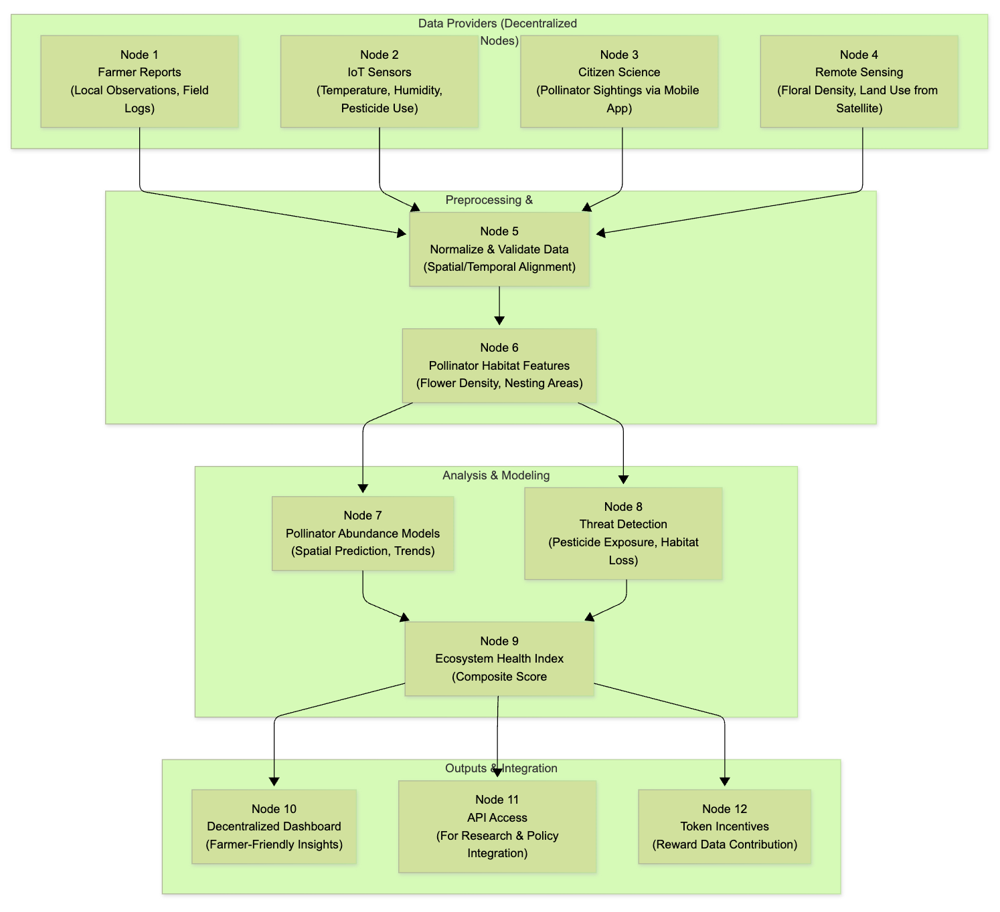
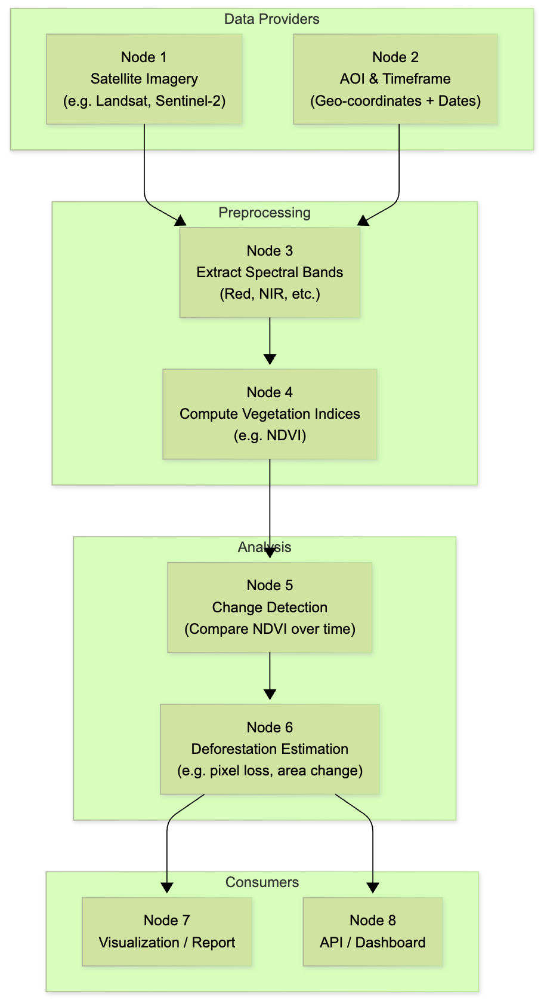

# Trustflow Node

> **Powering the decentralized backend of tomorrow.**

[](https://golang.org)
[](LICENSE)

---

**Trustflow Node** is an open-source, decentralized framework for trust-based data exchange and secure computation across distributed networks.
It orchestrates decentralized Docker and WASM runtimes, enabling robust, verifiable, and scalable infrastructure for the next generation of decentralized applications.

---

## Features

- 🛡️ **Decentralized Trust Infrastructure**
- 🐳 **Docker & WASM Runtime Orchestration**
- 📊 **Resource Monitoring**
- 🔒 **Key Management**
- 💬 **Modular Services**
- 🔗 **Blockchain-Ready**

---

## Getting Started

### Prerequisites

- Go 1.21+
- Docker
- SQLite database

### Installation

```bash
git clone https://github.com/Trustflow-Network-Labs/trustflow-node.git
cd trustflow-node
go build -o trustflow-node .
# end
```

### Configuration

1. Copy `.env.example` to `.env` and configure environment variables.
2. Modify `configs` for advanced settings (e.g., database, networking, runtime options).

### Running

```bash
# interactive menu mode
./trustflow-node start
# end
```

```bash
# run as daemon
./trustflow-node daemon
# end
```

---

## Project Structure

| Directory               | Purpose                                           |
|--------------------------|---------------------------------------------------|
| `cmd/`                   | Application entrypoint                           |
| `node/`                  | Core node runtime logic                           |
| `database/`              | Persistence layer                                  |
| `keystore/`              | Key and identity management modules               |
| `price/`                 | External price feed integrations                  |
| `resource-utilization/`  | Node performance monitoring                       |
| `utils/`                 | Common utilities and helpers                      |
| `workflow/`              | Task and workflow orchestration                   |

---

## Contributing

Contributions are welcome and appreciated!

Steps to contribute:

1. Fork this repo
2. Create your feature branch: `git checkout -b my-new-feature`
3. Commit your changes: `git commit -am 'Add some feature'`
4. Push to the branch: `git push origin my-new-feature`
5. Submit a pull request 🚀

---

## License

This project is licensed under the MIT License.  
See the [LICENSE](LICENSE) file for details.

---

## Links

- [Issue Tracker](https://github.com/Trustflow-Network-Labs/trustflow-node/issues)
- [Trustflow Network Labs GitHub](https://github.com/Trustflow-Network-Labs)

---

## Workflow Example

The following diagrams illustrate examples of end-to-end ecological monitoring workflows—starting with decentralized data integration for pollinator species management in agroecosystems, and extending to satellite-based deforestation estimation.

- Ddecentralized data integration for pollinator species management in agroecosystems



- Satellite-based deforestation estimation


